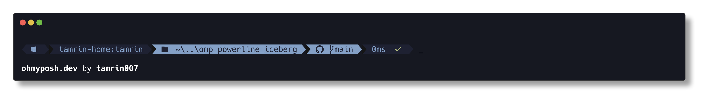

# omp_powerline_iceberg

A oh-my-posh theme inspired by [cocopon/iceberg.vim](https://github.com/cocopon/iceberg.vim).



## Installation

Clone this repo and write the config on your profile.

```
git clone https://github.com/Tamrin007/omp_powerline_iceberg.git
echo 'oh-my-posh init pwsh --config "<path to repo>\omp_powerline_iceberg.json" | Invoke-Expression' >> $PROFILE
```
